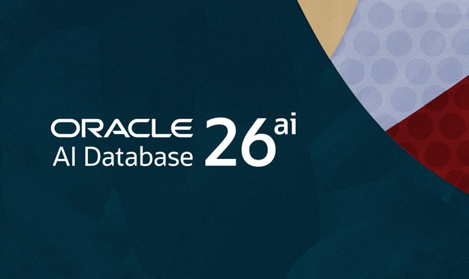

### Oracle Database Free 26ai Spin‑Off



This is a containerized project based on **Oracle Database Free 26ai**. It provides a reproducible environment with persistent storage, vector capability, and automation helpers via `docker-compose` and `Makefile`.

#### Prologue
> “Today, developers building AI-powered applications are driving technology decisions like never before. Empowering them with frictionless tools is critical to fueling the next wave of innovative, user-centric apps. Oracle AI Database 26ai Free breaks down access barriers, putting advanced AI—which will include in-database AI agents—directly in developers’ hands and enable them to shape the future on their own terms. This move reinforces Oracle’s commitment to the developer community.”

See also: [Oracle AI Database 26ai Powers the AI for Data Revolution](https://www.oracle.com/news/announcement/ai-world-database-26ai-powers-the-ai-for-data-revolution-2025-10-14/)


#### I. Project Structure

```
Ora26ai/
├── docker-compose.yml   # Service definition
├── Makefile             # Automation helper
├── .env                 # Configuration parameters
└── oradata/             # Persistent storage (created manually)
```


#### II. Prerequisites

- Docker Engine ≥ 20.10  
- Docker Compose plugin ≥ 2.0  
- GNU Make (Linux/macOS; Windows via WSL or Git Bash)  
- Oracle account (required for container registry access)  


#### III. Configuration

All important parameters are stored in `.env`:

```
# Oracle Database image
ORACLE_IMAGE=container-registry.oracle.com/database/free:latest

# Container name
ORACLE_CONTAINER=ora26ai-db

# Ports
ORACLE_PORT_LISTENER=1521
ORACLE_PORT_EMEXPRESS=5500

# Database settings
ORACLE_PWD=MyStrongPass123
ORACLE_CHARACTERSET=AL32UTF8

# Directories
DATA_DIR=./oradata
```

You can edit `.env` directly or run:

```
make config
```


#### IV. First Run Ritual

Before pulling and running the Oracle Database Free 26ai image, complete these steps:

##### 1. Sign in to Oracle Container Registry
- Open your web browser and go to [Oracle Container Registry](https://container-registry.oracle.com/ords/f?p=113:10::::::).
- Navigate to **Database → Free**.
- Sign in with your **Oracle Cloud account credentials** (Oracle calls this your “Oracle account” in the registry).
- Accept the **license agreement** for the repository.  
  
This step is mandatory — without accepting the license in the web portal, `docker pull` will fail even if you run `docker login`.

##### 2. Log in from your terminal
After these two steps, Docker will cache your credentials locally, so you won’t need to log in again unless you clear your Docker config, switch machines, or Oracle updates the license terms.

Run:
```
docker login container-registry.oracle.com
```
- Enter your Oracle account username and password.
- Credentials will be stored locally so Docker can access the registry.

Note: You will enter your username and password **twice**:
1. Once in the web browser to sign in and accept the license.  
2. Again in your terminal when you run `docker login container-registry.oracle.com`.

> Oracle AI Database 26ai Free is the free edition of the industry-leading database. The Oracle AI Database 26ai Free Container Image contains Oracle AI Database 26ai Free based on an Oracle Linux 8 base image.

> Two flavors of the image are supported:

- The **Full image**: supports all the database features provided by Oracle AI Database 26ai Free.
```
docker pull container-registry.oracle.com/database/free:23.26.2.0
```

- The **Lite image**: smaller image size with a stripped-down installation of the database.
```
docker pull  container-registry.oracle.com/database/free:23.26.2.0-lite
```

> The Lite image has a smaller storage footprint than the Full image (~80% image size reduction) and a substantial improvement in image pull time. This image is useful in CI/CD scenarios and for simpler use cases where advanced database features are not required.


##### 3. Prepare the data folder
Create the persistent storage directory:
```
mkdir -p ./oradata
```

Set permissions so the Oracle user inside the container can write:
```
sudo chown -R 54321:54321 ./oradata
```
- `54321:54321` is the default UID/GID for Oracle inside the container.
- Adjust if your host requires different ownership.

##### 4. Pull the image
Now you can safely pull the full 26ai image:
```
docker pull container-registry.oracle.com/database/free:latest
```

##### 5. Start the stack
Bring up the containerized database:
```
make up
```

##### 6. Verify logs
Check the startup sequence:
```
make logs
```


#### V. Makefile Targets

- `make up` → start all services  
- `make down` → stop and remove services  
- `make restart` → restart services  
- `make ps` → show running containers  
- `make logs` → tail logs  
- `make prune` → clear logs from `DATA_DIR`  
- `make config` → edit `.env`  
- `make exec` → open shell inside the Oracle container  


#### VI. Connection Details

- **Host**: `localhost`  
- **Port**: `1521` (listener)  
- **Service name**: `FREEPDB1`  
- **User**: `SYSTEM` / `PDBADMIN`  
- **Password**: value of `ORACLE_PWD` in `.env`  


#### VII. Quick‑Start SQL Demo (Vector Capability)

Once inside the container (`make exec`), connect with `sqlplus`:

```
sqlplus SYSTEM/${ORACLE_PWD}@//localhost:1521/FREEPDB1
```

Create a table with a vector column:

```
CREATE TABLE embeddings (
  id NUMBER GENERATED BY DEFAULT AS IDENTITY PRIMARY KEY,
  text VARCHAR2(200),
  embedding VECTOR(1536)  -- dimension size depends on your model
);
```

Insert sample data:

```
INSERT INTO embeddings (text, embedding)
VALUES ('Hello Oracle AI', TO_VECTOR('[0.12, 0.98, ...]'));
```

Run a similarity query:

```
SELECT text
FROM embeddings
ORDER BY VECTOR_DISTANCE(embedding, TO_VECTOR('[0.10, 0.95, ...]'))
FETCH FIRST 5 ROWS ONLY;
```


#### VIII. Notes

- Use the **full image** (`ORACLE_IMAGE=.../free:latest`) to enable vector capability.  
- Data persists in `./oradata` even if the container is removed.  
- Password must be ≥12 chars, with uppercase, lowercase, and digit.  


#### IX. Limitations
> Oracle Database 26ai Free is available under a specific no-cost license for developers, learners, and production use with strict resource caps, allowing free use without time limits.

**Key License and Resource Limits**

- **User Data Limit**: Maximum of 12 GB of user data.
- **CPU Limit**: Usable with up to 2 CPUs (threads).
- **Memory Limit**: Restricted to 2 GB of RAM.
- **Pluggable Databases**: Supports 1 PDB (Pluggable Database) alongside the root container
- **No Time Limits**: The free tier does not expire after a set trial period.
- **No Patches**: Oracle does not release software patches or updates for the free edition; you must upgrade or switch to a paid edition (Standard or Enterprise) for formal patch support.
- **Usage Rights**: Can be used for building, testing, prototyping, and light production workloads, subject to the official Oracle terms.

See also: [Oracle Database Free FAQ](https://www.oracle.com/database/free/faq/)


#### X. Bibliography 
1. [Oracle AI Database Free](https://www.oracle.com/database/free/)
2. [Oracle AI Database 26ai Free Container Image Documentation](https://container-registry.oracle.com/ords/f?p=113:4:101267054238122:::4:P4_REPOSITORY,AI_REPOSITORY,AI_REPOSITORY_NAME,P4_REPOSITORY_NAME,P4_EULA_ID,P4_BUSINESS_AREA_ID:1863,1863,Oracle%20Database%20Free,Oracle%20Database%20Free,1,0&cs=3Dza398kgnsVjPJxjBoDqAiUpP29VlkV0aZ5RoA0RGJpFqmxJg4o2g7xFKr3NcFHd_uNEdF0nX7fJxqVHtMKIwQ)
3. [Oracle AI Database Free – Quick Start](https://www.oracle.com/database/free/get-started/#linux8)
4. [Oracle Container Registry](https://container-registry.oracle.com/ords/f?p=113:10::::::)
5. [Installation and Getting Started Video](https://www.youtube.com/watch?v=YwcicSS9DOY)
6. [The Book of Disquiet by Fernando Pessoa](https://dn720004.ca.archive.org/0/items/english-collections-1/Book%20of%20Disquiet%2C%20The%20-%20Fernando%20Pessoa.pdf)


#### Epilogue 
```
https://container-registry.oracle.com/ords/f?p=113:10:113062632226910:::::
https://container-registry.oracle.com/ords/ocr/ba/database

docker pull container-registry.oracle.com/database/free:23.26.2.0
docker pull  container-registry.oracle.com/database/free:23.26.2.0-lite

docker pull container-registry.oracle.com/database/free:latest
docker pull  container-registry.oracle.com/database/free:latest-lite
```


### EOF 
